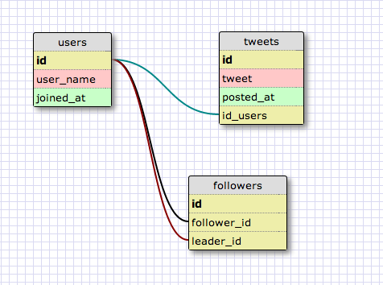

# U3.W7: Modeling a Real-World Database (SOLO CHALLENGE)

## Release 0: Users Fields
-- username

-- joined_at

-- tweets

-- photos/videos

-- following

-- followers

-- favorites

<!-- Identify the fields Twitter collects data for -->

## Release 1: Tweet Fields
-- Looks like text with a limit of 140 characters. You can also add images and locations

## Release 2: Explain the relationship
The relationship between `users` and `tweets` is: one-to-many. A single tweet has one user as an owner, but a single user can have many tweets

<!-- because... -->

## Release 3: Schema Design
1. users table
  * id
  * user_name
  * joined_at

2. tweets table
  * id
  * user_id
  * tweet
  * posted_at

3. followers table
  * id
  * follower_id
  * leader_id

  ### 

This is the table than enables a many-to-many relationship between followers and leaders

<!-- Include your image (inline) of your schema -->

## Release 4: SQL Statements
- all the tweets for a certain user id
	- SELECT tweet FROM tweets WHERE user_id = 12423

- the tweets for a certain user id that were made after last Wednesday (whenever last Wednesday was for you)
	- SELECT tweet FROM tweets JOIN users on users.id = tweets.user_id WHERE user_id = 124242 AND posted_at >= '12/2/2014'

- all the tweets associated with a given user's twitter handle
	- SELECT tweet FROM tweets JOIN users on users.id = tweets.user_id WHERE user_name = 'jackass123'

- the twitter handle associated with a given tweet id 
	- SELECT user_name FROM users JOIN tweets on users.id = tweets.user_id WHERE tweets.id = 1242123

## Release 5: Reflection
-- Fun exercise - interesting to see real world applications of some of the work we're doing
<!-- Be sure to add your reflection here!!! -->